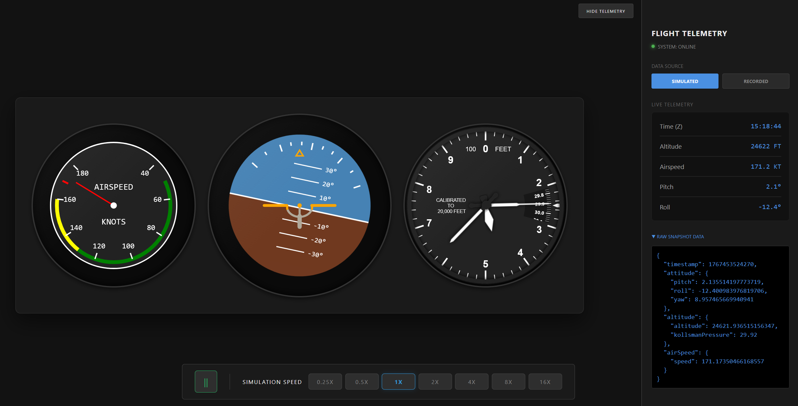

# Aviation Project

A full-stack application for real-time flight telemetry visualization. This project features a Spring Boot backend that streams flight data via WebSockets and a React-based frontend cockpit dashboard.

## UI Preview

## Project Overview

The **Aviation Project** provides a real-time cockpit interface with live flight instruments. It supports two modes of data:
- **Simulated**: Real-time generation of flight data using simulator services.
- **Recorded**: Playback of historical flight data from CSV logs.

### Project Structure

- **`/backend`**: Spring Boot application handling telemetry logic, CSV parsing, and WebSocket streaming.
- **`/frontend`**: React/TypeScript application providing the visual cockpit dashboard and flight instruments.

## Key Features

- **Live Flight Instruments**: Visual Attitude Indicator (Pitch/Roll), Altimeter, and Airspeed Indicator.
- **WebSocket Streaming**: Low-latency data delivery using STOMP over SockJS.
- **Data Flexibility**: Ability to switch between live simulations and recorded CSV data.
- **Simulation & Playback Control**: 
    - **Pause/Resume**: Instantly freeze simulation state across both live and recorded providers.
    - **Variable Time Scale**: Analysis-grade speeds from **0.25x** (for landing analysis) up to **16x** (for rapid transitions).
    - **Time-Deterministic Engine**: Backend services utilize a scaled `deltaTime` architecture for smooth movement at any speed.

## Project Structure

This project uses GitHub Actions to automate testing and quality assurance:

- **Backend Tests**: Triggered on every push and pull request. It sets up JDK 21, runs the Gradle test suite, and generates a JaCoCo coverage report which is then uploaded to Codecov.
- **Frontend Tests**: Triggered when changes are made to the `frontend` directory. It installs dependencies and runs the test suite using Node.js to ensure UI stability.

> **Note on Monorepo CI**: Since this is a monorepo and the `master` branch ruleset requires backend tests to pass for all merges, the backend workflow currently triggers on every push to ensure compliance. A planned improvement is to optimize this so that backend tests only run when files within the `/backend` directory are modified.
