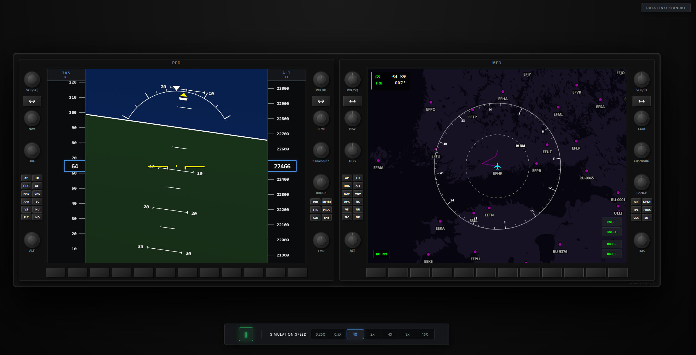

# Aviation Project

A high-fidelity Primary Flight Display (PFD) and Multi-Function Display (MFD) simulation system. This project features a Spring Boot backend that streams real-time telemetry via WebSockets to a React-based "Glass Cockpit" dashboard.

## UI Preview

## Project Overview

The **Aviation Project** provides a real-time cockpit interface with live flight instruments. It supports two modes of data:

- **Simulated**: Real-time generation of flight data using simulator services.
- **Recorded**: Playback of historical flight data from CSV logs.

### Project Structure

- **`/backend`**: Spring Boot application handling telemetry logic, CSV parsing, and WebSocket streaming.
- **`/frontend`**: React/TypeScript application providing the visual cockpit dashboard and flight instruments.

## Key Features

- **Primary Flight Display (PFD)**: High-fidelity instrumentation including:
  - **Airspeed & Altitude Tapes**: Optimized vertical sliding scales.
  - **Attitude Indicator**: SVG-based artificial horizon with synchronized sky-pointer bank scale.
- **Multi-Function Display (MFD)**: Modern navigation display with:
  - **Moving Map**: Real-time tracking of aircraft position.
  - **Flight Plan Visualization**: Display of waypoints and active flight path.
- **Integrated Cockpit Controls**:
  - **Physical Knobs & Buttons**: Realistic interaction model for NAV/COM frequencies, heading, altitude, and menu navigation.
  - **Softkeys**: Dynamic context-sensitive buttons aligned with the display width.
- **Quiet Dark Cockpit Philosophy**: Professional UI design where buttons only "light up" when active, reducing pilot distraction.
- **Universal Simulation Control**:
  - **Dampened Playback**: Pause/Play and variable time scaling (0.25x to 16x) with a time-deterministic `deltaTime` engine.
  - **Data Flexibility**: Instant switching between live simulations and historical CSV playback.
- **Low-Latency Streaming**: STOMP over WebSockets broadcasting telemetry at 20Hz.

## CI/CD

This project uses GitHub Actions to automate testing and quality assurance:

- **Backend Tests**: Triggered on every push and pull request. It sets up JDK 21, runs the Gradle test suite, and generates a JaCoCo coverage report which is then uploaded to Codecov.
- **Frontend Tests**: Triggered when changes are made to the `frontend` directory. It installs dependencies and runs the test suite using Node.js to ensure UI stability.

> **Note on Monorepo CI**: Since this is a monorepo and the `master` branch ruleset requires backend tests to pass for all merges, the backend workflow currently triggers on every push to ensure compliance. A planned improvement is to optimize this so that backend tests only run when files within the `/backend` directory are modified.
